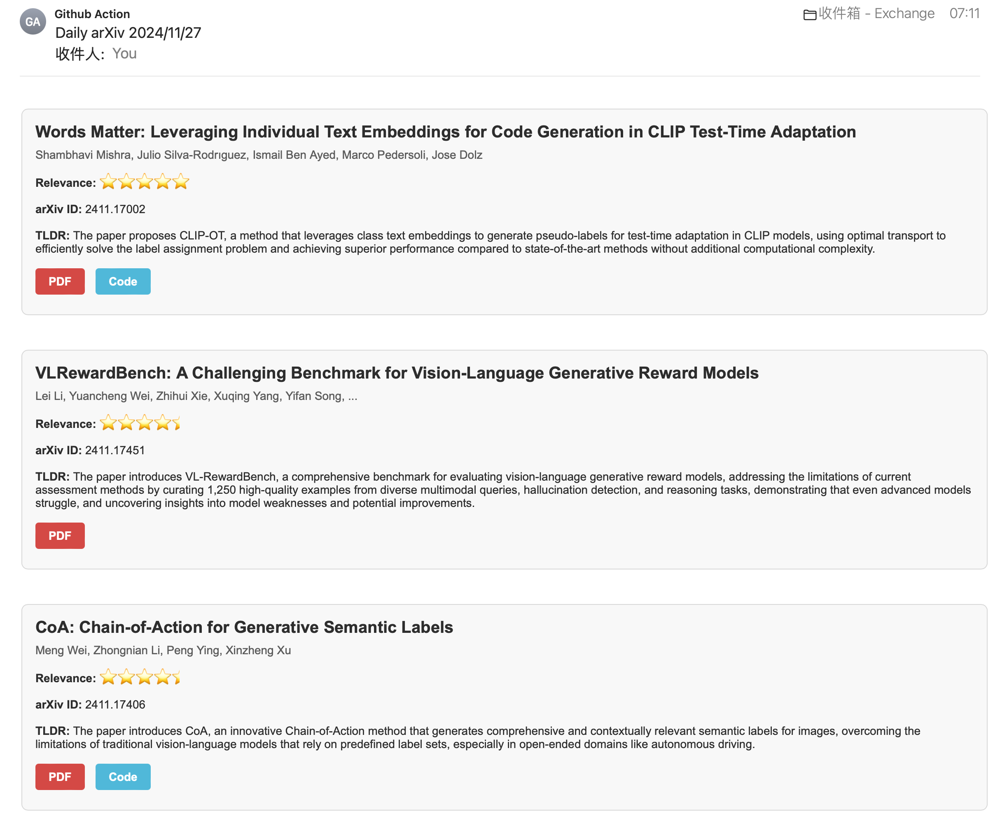
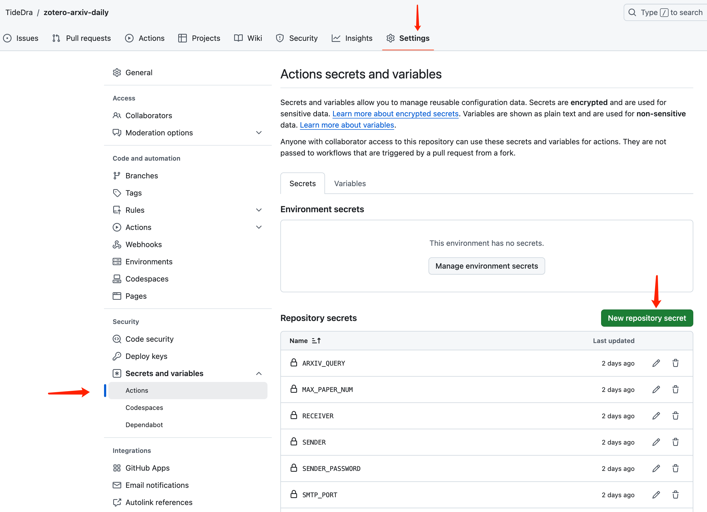
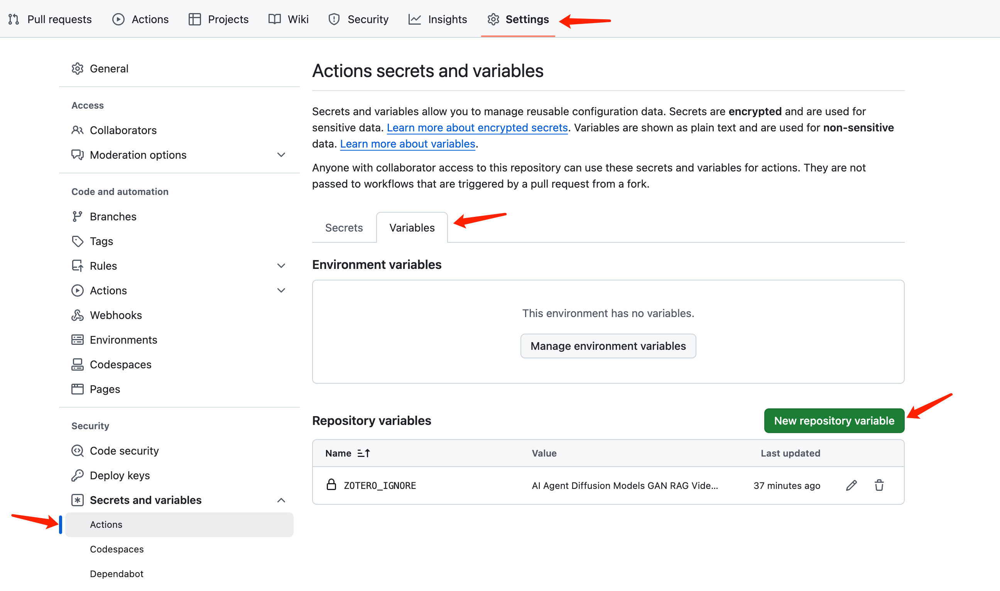
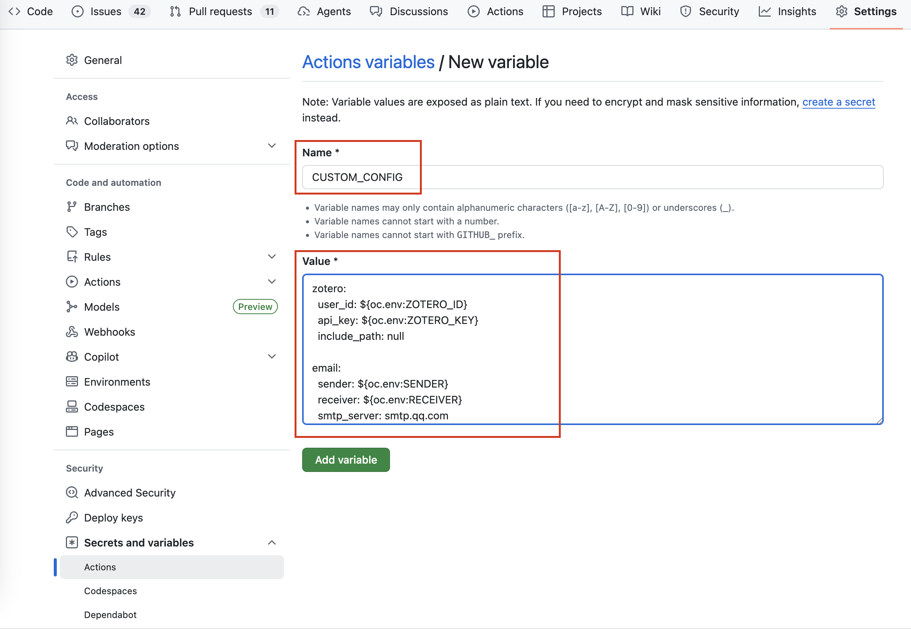
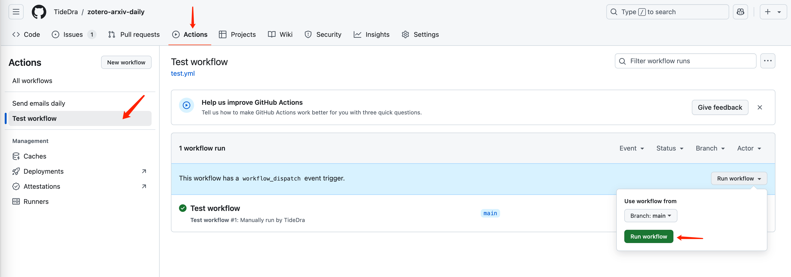

<p align="center">
  <a href="" rel="noopener">
 </a>
</p>

<h3 align="center">Auto Paper Pipeline</h3>

<div align="center">

  []()

</div>

---

<p align="center">Fetch new arXiv papers of your interest daily by keywords, have an LLM read them, and email you the most valuable ones — fully automated via GitHub Actions.
    <br>
</p>

## 🧐 About

*Auto Paper Pipeline* pulls fresh arXiv papers every day, filters them by **your keywords**, has an LLM rate each on **innovation / relevance / potential**, then writes a Chinese deep-read (核心工作 / 主要创新 / 潜在价值) for the top-N, and mails the result to you. Runs on GitHub Actions with **zero infrastructure cost**.

No Zotero, no reading list, no local machine required. Just keywords.

## ✨ Features

- **Keyword-driven** — supply a list of keywords; papers not matching are dropped before any LLM call (saves tokens).
- **LLM-graded ranking** — each candidate is rated on innovation/relevance/potential in 0–10, then ranked by weighted score.
- **Chinese structured TL;DR** — the top-N papers are re-read by the LLM and summarized into three sections: 核心工作 / 主要创新 / 潜在价值.
- **HTML email delivery** — nicely formatted paper cards with score, authors, affiliations, PDF link.
- **Full-text aware** — extracts TeX / HTML / PDF to feed the LLM, not just the abstract.
- **GitHub Actions native** — free quota, runs on a cron, configured entirely through repo secrets + a YAML variable.
- **Zotero still supported** — set `ZOTERO_ID`/`ZOTERO_KEY` and switch `reranker` back to `local`/`api` if you want library-based similarity ranking.

## 📷 Screenshot



## 🚀 Usage

### Quick Start

1. **Fork this repo into your own GitHub account.**
   

2. **Set GitHub Action repository secrets.** These are invisible to anyone (including you) once set, for security.
   

   | Key | Required | Description | Example |
   | :--- | :---: | :--- | :--- |
   | `SENDER` | ✅ | Email account of the SMTP server that sends the mail. | `abc@qq.com` |
   | `SENDER_PASSWORD` | ✅ | Password / **SMTP authentication code** of the sender account (not your login password — ask your email provider). | `abcdefghijklmn` |
   | `RECEIVER` | ✅ | The e-mail address that receives the paper list. | `abc@outlook.com` |
   | `OPENAI_API_KEY` | ✅ | API key for the LLM. Any OpenAI-compatible provider works (OpenAI, DeepSeek, SiliconFlow, etc.). | `sk-xxx` |
   | `OPENAI_API_BASE` | ✅ | Base URL of the LLM API. | `https://api.openai.com/v1` |
   | `ZOTERO_ID` | ⬜ | Zotero user ID. Leave unset for pure keyword mode. | `12345678` |
   | `ZOTERO_KEY` | ⬜ | Zotero API key. Leave unset for pure keyword mode. | `AB5tZ877...` |

3. **Set the `CUSTOM_CONFIG` repository variable** (a public variable, not a secret).
   
   

   Paste the following into the value of `CUSTOM_CONFIG`, then edit the `keywords` / `category` / `model` to your liking:

   ```yaml
   zotero:
     user_id: ${oc.env:ZOTERO_ID,null}      # Leave secrets unset to disable Zotero
     api_key: ${oc.env:ZOTERO_KEY,null}
     include_path: null

   email:
     sender: ${oc.env:SENDER}
     receiver: ${oc.env:RECEIVER}
     smtp_server: smtp.qq.com              # Your email provider's SMTP server
     smtp_port: 465
     sender_password: ${oc.env:SENDER_PASSWORD}

   llm:
     api:
       key: ${oc.env:OPENAI_API_KEY}
       base_url: ${oc.env:OPENAI_API_BASE}
     generation_kwargs:
       model: gpt-4o-mini                  # Or any OpenAI-compatible model
     language: Chinese

   source:
     arxiv:
       category: ["cs.AI","cs.LG","cs.RO"] # Coarse arXiv category filter
       include_cross_list: true
       keywords:                            # Fine-grained keyword filter (case-insensitive)
         - "reinforcement learning"
         - "model predictive control"
         - "residual policy"

   executor:
     debug: ${oc.env:DEBUG,null}
     send_empty: false
     max_paper_num: 10                     # Top-N papers shown in the email
     source: ['arxiv']
     reranker: keyword_llm                 # keyword_llm | local | api
   ```

   > `${oc.env:XXX,yyy}` resolves to environment variable `XXX`, falling back to `yyy` when unset.

4. **Trigger the workflow manually to test it.**
   

   Check the workflow log and your inbox. The main workflow (`Send-emails-daily`) also runs automatically every day at **22:00 UTC** (≈ 06:00 Beijing next day). Adjust the cron in `.github/workflows/main.yml` if you prefer another time.

### Full configuration reference

See [config/base.yaml](config/base.yaml) for every available knob, including:
- `reranker.keyword_llm.weights` — reweight innovation/relevance/potential
- `reranker.keyword_llm.threshold` — drop papers below a minimum composite score
- `reranker.keyword_llm.concurrency` — parallel LLM scoring requests
- `source.arxiv.include_cross_list` — include cross-listed papers
- `executor.send_empty` — still send the email even when no paper is found

### Local Running

Powered by [uv](https://github.com/astral-sh/uv):
```bash
# export SENDER=... SENDER_PASSWORD=... RECEIVER=...
# export OPENAI_API_KEY=... OPENAI_API_BASE=...
cd auto-paper-pipeline
uv sync
DEBUG=true uv run src/zotero_arxiv_daily/main.py
```

## 📖 How it works

1. **Retrieve** — arXiv RSS feed gives today's newly-announced papers in the configured categories.
2. **Keyword pre-filter** — papers whose title or abstract doesn't mention any of your keywords are dropped (saves LLM cost).
3. **LLM scoring** — each surviving paper is rated on innovation / relevance / potential (0–10 each) and ranked by the weighted composite.
4. **Deep read** — top-N papers are fed (title + abstract + extracted full text) into the LLM again to produce a structured Chinese summary: 核心工作 / 主要创新 / 潜在价值.
5. **Email** — rendered as an HTML mail via SMTP.

## 🛠️ Switching back to Zotero-based recommendation

If you have a well-curated Zotero library you'd rather use as your interest profile:
1. Fill `ZOTERO_ID` and `ZOTERO_KEY` secrets.
2. Change `executor.reranker` to `local` (free, runs a small embedding model on the Actions runner) or `api` (uses an OpenAI-compatible embeddings endpoint).
3. Optionally drop the `keywords` list to consider all papers in the categories.

## 📌 Limitations

- arXiv RSS is the only source. Google Scholar has no stable API and would not survive on GitHub Actions runners.
- The LLM scoring is only as good as the prompt + model; for niche domains, expect some noise. Raise `max_paper_num` or tune `weights` to taste.
- GitHub Actions has a per-repo quota (6 h/run, 2000 min/month for private repos). Daily runs with `max_paper_num: 10` comfortably fit for public repos.

## 📃 License

Distributed under the AGPLv3 License. See `LICENSE` for detail.

## ❤️ Acknowledgement

This project is a derivative work that stands on the shoulders of two excellent open-source projects:

- [**TideDra/zotero-arxiv-daily**](https://github.com/TideDra/zotero-arxiv-daily) — the GitHub Actions + SMTP + Zotero-based recommendation foundation that this repo forks and extends.
- [**ReadPaperEveryday**](https://github.com/) — inspired the keyword-based arXiv crawl and Chinese deep-read summarization style.

Additional thanks to:
- [pyzotero](https://github.com/urschrei/pyzotero)
- [arxiv](https://github.com/lukasschwab/arxiv.py)
- [sentence_transformers](https://github.com/UKPLab/sentence-transformers)
